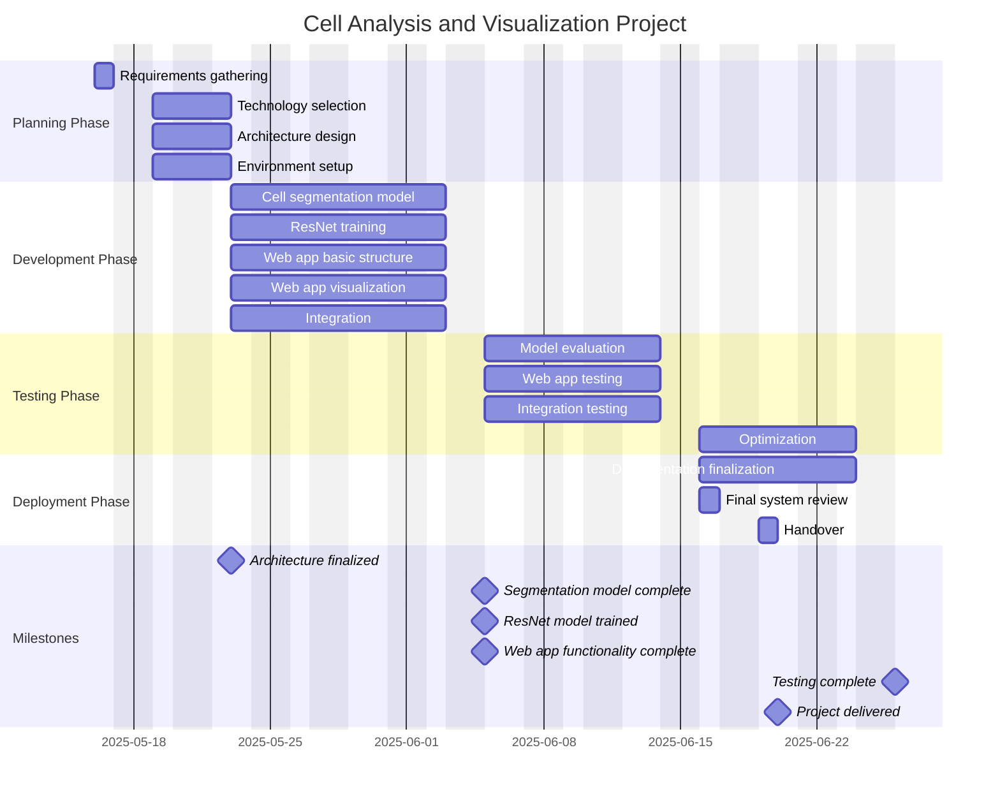

# Project Timeline (Mermaid Gantt Chart)




# design-patterns

[![Actions Status][actions-badge]][actions-link]
[![PyPI version][pypi-version]][pypi-link]
[![PyPI platforms][pypi-platforms]][pypi-link]

Examples of software design patterns.

## Installation


Install [pixi](https://pixi.sh):

- Linux and MacOS
    ```bash
    curl -fsSL https://pixi.sh/install.sh | bash
    ```
- Windows (powershell)
    ```bash
    iwr -useb https://pixi.sh/install.ps1 | iex
    ```

Install the dependencies, including the dev dependencies
    ```bash
    pixi install --all
    ```
or install only the runtime dependencies
    ```bash
    pixi install --environment default
    ```


## Usage

Execute the main script with

    ```bash
    pixi run python my_file.py
    ```


## Documentation

Generate the documentation locally with

    ```bash
    pixi run -e dev mkdocs serve --watch ./
    ```


## Contributing

See [CONTRIBUTING.md](CONTRIBUTING.md) for instructions on how to contribute.

## License

Distributed under the terms of the [MIT license](LICENSE).
